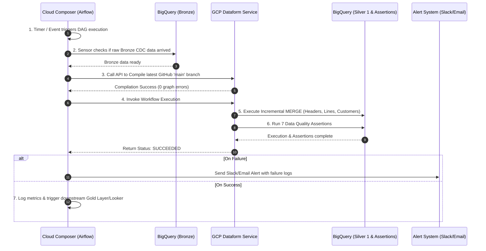

# Oracle EBS Bronze to Silver 1 Dataform Pipeline

This repository contains a production-ready **Google Cloud Dataform (Core v3+)** pipeline and **Cloud Composer (Apache Airflow)** automation DAG. It cleans, deduplicates, transforms, and validates Change Data Capture (CDC) extracts from an **Oracle E-Business Suite (EBS) Order Management** system in BigQuery, migrating raw data from the **Bronze layer** (`oracle_ebs_bronze`) to a structured, query-optimized **Silver 1 layer** (`oracle_ebs_silver1`).

---

## GCP Configuration

| Setting | Value |
| :--- | :--- |
| **GCP Project ID** | `YOUR_GCP_PROJECT_ID` |
| **GCP Account** | `your-service-account@YOUR_GCP_PROJECT_ID.iam.gserviceaccount.com` |
| **BigQuery Location** | `US` |
| **Bronze Dataset** | `oracle_ebs_bronze` |
| **Silver 1 Dataset** | `oracle_ebs_silver1` |
| **Assertion Dataset** | `oracle_ebs_assertions` |
| **Dataform Core Version** | `3.0.0` |

---

## How It Works



The automated pipeline operates across 8 distinct sequential stages managed end-to-end by Cloud Composer and Dataform:

### Step 1: Trigger & Schedule
- **Automated Scheduling**: Cloud Composer (Airflow DAG `ebs_bronze_to_silver1_pipeline`) initiates execution automatically based on a cron schedule (e.g., hourly at minute 0: `0 * * * *`).
- **Event-Driven Execution**: Can also be triggered automatically when upstream ingestion tools (such as Fivetran, Qlik Replicate, GoldenGate, or Airbyte) finish dumping new raw CDC batches into BigQuery Bronze.

### Step 2: Data Readiness Check
- Before running transformations, an upstream sensor checks `oracle_ebs_bronze.OE_ORDER_HEADERS_ALL` to ensure new CDC records have arrived.
- Prevents unnecessary slot consumption and avoids processing empty or incomplete data batches.

### Step 3: Dataform Repository Compilation
- Composer sends an API request to the GCP Dataform API (`DataformCreateCompilationResultOperator`).
- Dataform fetches the latest repository code from the `main` Git branch.
- Dataform compiles `workflow_settings.yaml` and all `.sqlx` definitions, building a Dependency Direct Acyclic Graph (DAG) and ensuring zero syntax or graph structural errors.

### Step 4: Incremental MERGE Execution
- Composer invokes workflow execution (`DataformCreateWorkflowInvocationOperator`), running BigQuery SQL transformations in strict dependency order:
  1. **Incremental Filtering**: Filters raw records where `LAST_UPDATE_DATE >= MAX(last_update_date)` of existing Silver 1 tables.
  2. **CDC Deduplication**: Ranks updates via `ROW_NUMBER() OVER (PARTITION BY primary_key ORDER BY LAST_UPDATE_DATE DESC, _FIVETRAN_SYNCED DESC)` to select only the latest state (`row_num = 1`).
  3. **Soft Delete Filtering**: Excludes records where `_FIVETRAN_DELETED IS TRUE`.
  4. **BigQuery MERGE**: Performs atomic upserts into target Silver 1 tables (`stg_ebs_oe_order_headers`, `stg_ebs_oe_order_lines`, `stg_ebs_hz_cust_accounts`).

### Step 5: Automated Data Quality Assertions
Immediately after table materializations finish, Dataform executes **7 automated assertions** against the target tables in schema `oracle_ebs_assertions`:
- **Primary Key Uniqueness**: Verifies no duplicate `header_id`, `line_id`, or `cust_account_id` entries exist.
- **Non-Null Constraints**: Validates that critical business fields (`header_id`, `line_id`, `cust_account_id`, `ordered_quantity`) are non-null.
- **Referential Integrity Check** (`assert_order_lines_header_fk`): Custom SQL assertion verifying every order line references a valid header in `stg_ebs_oe_order_headers`.

### Step 6: Status Monitoring & Polling
- Cloud Composer monitors the execution status via API polling until the Dataform job reaches a terminal state (`SUCCEEDED` or `FAILED`).

### Step 7: Automated Error Handling & Alerting
- If any transformation query fails or any of the 7 quality assertions fail:
  - Execution halts immediately to prevent corrupting downstream tables.
  - Airflow triggers automatic retries based on configured retry policy (e.g., retry once after 5 minutes).
  - If retries fail, Composer sends immediate alert notifications (Email, Slack, or PagerDuty) with error stack traces and BigQuery execution IDs.

### Step 8: Downstream Integration
- Upon successful execution (`SUCCEEDED`), Composer logs pipeline performance metrics (duration, rows processed) and triggers downstream analytical processes (e.g., Gold layer aggregation, ML model feature pipelines, or Looker Studio dashboard cache updates).

---

## Repository Structure

```
.
├── workflow_settings.yaml              # Dataform Core v3+ project configuration
├── README.md                           # Pipeline documentation & architecture guide
├── definitions/
│   ├── sources/                        # Bronze layer table declarations
│   │   ├── src_oe_order_headers_all.sqlx
│   │   ├── src_oe_order_lines_all.sqlx
│   │   └── src_hz_cust_accounts.sqlx
│   ├── silver1/                        # Silver 1 incremental transformations
│   │   ├── stg_ebs_oe_order_headers.sqlx
│   │   ├── stg_ebs_oe_order_lines.sqlx
│   │   └── stg_ebs_hz_cust_accounts.sqlx
│   ├── assertions/                     # Custom Data Quality assertions
│   │   └── assert_order_lines_header_fk.sqlx
│   └── observability/                  # Looker Studio observability views
│       ├── vw_obs_pipeline_status.sqlx
│       ├── vw_obs_assertion_health.sqlx
│       └── vw_obs_ingestion_volume.sqlx
├── dags/                               # Cloud Composer (Airflow) automation DAGs
│   └── ebs_bronze_to_silver1_pipeline.py
└── scripts/                            # Test seed scripts for local validation
    └── seed_bronze_tables.sql
```

---

## Observability: Day 1 Looker Studio Dashboard

The pipeline includes **3 pre-built BigQuery Views** in `oracle_ebs_silver1` that directly power a Day 1 Looker Studio observability dashboard:

### Dashboard Cards & Backing Views

| Dashboard Card | BigQuery View | What It Measures |
| :--- | :--- | :--- |
| **Card 1: Pipeline Status** | `vw_obs_pipeline_status` | Job durations, state (SUCCESS/FAILED), GB billed, slot usage from `INFORMATION_SCHEMA.JOBS`. |
| **Card 2: Assertion Health** | `vw_obs_assertion_health` | Count of failing rows per assertion, PASSING/CRITICAL FAILURE status labels. |
| **Card 4: Ingestion Volume** | `vw_obs_ingestion_volume` | Daily record count ingested per Silver 1 table via `silver1_ingestion_timestamp`. |

### Setting Up Looker Studio

1. Go to [Looker Studio](https://lookerstudio.google.com) and click **Create > Report**.
2. Add a **BigQuery** connector using project `YOUR_GCP_PROJECT_ID`, dataset `oracle_ebs_silver1`.
3. Connect each view as a separate data source:
   - `vw_obs_pipeline_status` → Card 1 (Scorecard + Table)
   - `vw_obs_assertion_health` → Card 2 (Scorecard + Status Chip)
   - `vw_obs_ingestion_volume` → Card 4 (Time Series Line Chart)
4. Set auto-refresh interval to **15 minutes**.

### Day 1 Alert Configuration

| Alert | Severity | Trigger Condition | Channel |
| :--- | :---: | :--- | :--- |
| **Pipeline Hard Failure** | SEV-1 🔴 | Airflow DAG status = `FAILED` after 1 retry | Slack `#data-pipeline-alerts` |
| **Assertion Failure** | SEV-1 🔴 | `vw_obs_assertion_health.failing_row_count > 0` | Slack `#data-pipeline-alerts` |
| **Ingestion Volume Delay** | SEV-2 🟡 | Bronze sensor timeout after 30 mins | Slack `#data-pipeline-alerts` |

---

## Cloud Deployment

### Prerequisites
- GCP Project `YOUR_GCP_PROJECT_ID` with BigQuery, Dataform, and Cloud Composer APIs enabled.
- Service Account with roles: `roles/dataform.editor`, `roles/bigquery.dataEditor`, `roles/bigquery.jobUser`.

### Step 1: Seed Bronze Tables (One-Time Setup)
```bash
bq query --project_id=YOUR_GCP_PROJECT_ID --use_legacy_sql=false < scripts/seed_bronze_tables.sql
```

### Step 2: Connect Dataform Repository
1. Open **BigQuery > Dataform** in Google Cloud Console.
2. Click **Create Repository** and connect to your GitHub repo `pparthas83/dataform_bronze_to_silver1` on branch `main`.

### Step 3: Deploy Cloud Composer DAG
```bash
gcloud composer environments storage dags import \
  --environment YOUR_COMPOSER_ENV_NAME \
  --location us-central1 \
  --source dags/ebs_bronze_to_silver1_pipeline.py
```

### Step 4: Initial Full Refresh Run
```bash
npx -y @dataform/cli run --full-refresh --default-project=YOUR_GCP_PROJECT_ID
```

### Step 5: Verify Output
```bash
# Verify Silver 1 tables were created
bq ls --project_id=YOUR_GCP_PROJECT_ID oracle_ebs_silver1

# Verify assertions passed (should return 0 rows)
bq query --project_id=YOUR_GCP_PROJECT_ID --use_legacy_sql=false \
  "SELECT * FROM oracle_ebs_assertions.assert_order_lines_header_fk"
```

---

## Local Development & Compilation

### Compile Project
```bash
npx -y @dataform/cli compile
```

Expected output:
```
Compiled 13 action(s).
6 dataset(s):
  oracle_ebs_silver1.vw_obs_assertion_health [view]
  oracle_ebs_silver1.vw_obs_ingestion_volume [view]
  oracle_ebs_silver1.vw_obs_pipeline_status [view]
  oracle_ebs_silver1.stg_ebs_hz_cust_accounts [incremental]
  oracle_ebs_silver1.stg_ebs_oe_order_headers [incremental]
  oracle_ebs_silver1.stg_ebs_oe_order_lines [incremental]
7 assertion(s): ...
```
