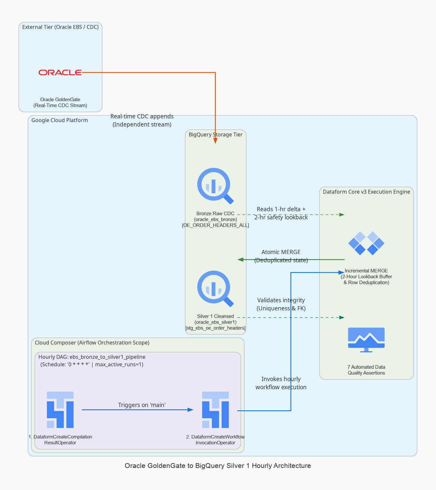
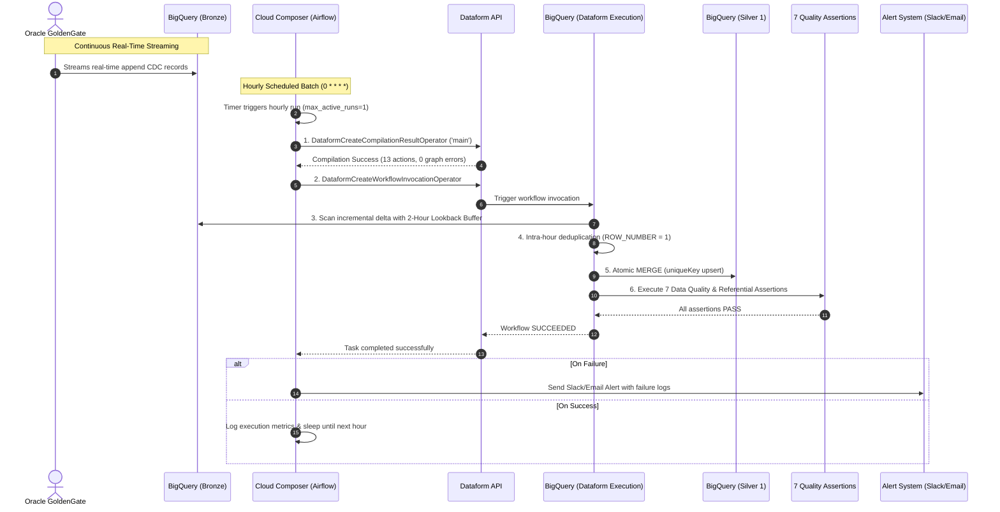

# Oracle EBS Bronze to Silver 1 Dataform Pipeline

This repository contains a production-grade **Google Cloud Dataform (Core v3+)** pipeline and **Cloud Composer (Apache Airflow)** automation DAG. It cleans, deduplicates, transforms, and validates Change Data Capture (CDC) extracts from an **Oracle E-Business Suite (EBS) Order Management** system in BigQuery, migrating raw data from the **Bronze layer** (`oracle_ebs_bronze`) to a structured, query-optimized **Silver 1 layer** (`oracle_ebs_silver1`).

---

## Architecture Overview

```
┌──────────────────────────────────────┐     ┌────────────────────────────────────────────────────────┐
│      REAL-TIME INGESTION TIER        │     │              GOOGLE CLOUD PLATFORM                     │
│                                      │     │                                                        │
│  [Oracle EBS Database]               │     │  [Cloud Composer / Airflow]                            │
│           │                          │     │      Schedule: '0 * * * *' | max_active_runs=1         │
│           ▼                          │     │      Task 1: Compile Git 'main'                        │
│  [Oracle GoldenGate Stream]          │     │      Task 2: Invoke Dataform Workflow                  │
│           │                          │     │                 │                                      │
│           ▼ (Append-only CDC)        │     │                 ▼                                      │
│  [BigQuery Bronze Tables] ───────────┼─────┼────────> [Dataform Core v3]                            │
│    - OE_ORDER_HEADERS_ALL            │     │            - 2-Hour Safety Lookback Buffer             │
│    - OE_ORDER_LINES_ALL              │     │            - Intra-Hour Row Deduplication              │
│    - HZ_CUST_ACCOUNTS                │     │            - Atomic BigQuery MERGE                     │
│                                      │     │                 │                                      │
│                                      │     │                 ▼                                      │
│                                      │     │          [BigQuery Silver 1 Tables]                    │
│                                      │     │            - stg_ebs_oe_order_headers                  │
│                                      │     │            - stg_ebs_oe_order_lines                    │
│                                      │     │            - stg_ebs_hz_cust_accounts                  │
│                                      │     │                 │                                      │
│                                      │     │                 ▼                                      │
│                                      │     │          [7 Automated Data Quality Assertions]         │
└──────────────────────────────────────┘     └────────────────────────────────────────────────────────┘
```

### Architecture Diagram



### Generative UI Interactive Diagrams

The repository includes 3 specialized HTML Generative UI diagrams located in [`docs/diagrams/`](docs/diagrams/):

| Diagram | File Link | Focus & Audience |
| :--- | :--- | :--- |
| **📐 Structural View** | [`docs/diagrams/diagram_structural.html`](docs/diagrams/diagram_structural.html) | High-level system topology, boundaries, and clean directional dataflow. |
| **⚙️ Operational View** | [`docs/diagrams/diagram_operational.html`](docs/diagrams/diagram_operational.html) | Technical contracts, BigQuery zero-cost API specs, 2-hr lookback buffer, and Airflow concurrency guards. |
| **🎮 Interactive Simulator** | [`docs/diagrams/diagram_interactive.html`](docs/diagrams/diagram_interactive.html) | Step-by-step playback simulator testing normal incremental syncs and referential assertion failures. |

---

## GCP Configuration

| Setting | Value |
| :--- | :--- |
| **GCP Project ID** | `YOUR_GCP_PROJECT_ID` |
| **GCP Account** | `your-service-account@YOUR_GCP_PROJECT_ID.iam.gserviceaccount.com` |
| **BigQuery Location** | `US` |
| **Bronze Dataset** | `oracle_ebs_bronze` |
| **Silver 1 Dataset** | `oracle_ebs_silver1` |
| **Assertion Dataset** | `oracle_ebs_assertions` |
| **Dataform Core Version** | `3.0.0` |

---

## How It Works



### Step 1: Continuous GoldenGate Streaming (Bronze Layer)
- Oracle GoldenGate captures Change Data Capture (CDC) events directly from Oracle EBS Order Management (`OE_ORDER_HEADERS_ALL`, `OE_ORDER_LINES_ALL`, `HZ_CUST_ACCOUNTS`).
- It streams records into BigQuery Bronze tables in **append-only mode**, capturing transaction timestamps (`LAST_UPDATE_DATE`) and CDC metadata without expensive continuous merges.

### Step 2: Hourly Airflow Orchestration (Cloud Composer)
- The Airflow DAG (`dags/ebs_bronze_to_silver1_pipeline.py`) executes on a fixed hourly schedule (`schedule_interval="0 * * * *"`).
- **Concurrency Guard**: Configured with `max_active_runs=1` to guarantee subsequent hourly runs never collide if a peak execution takes longer than expected.
- **Pure Orchestration**: Airflow coordinates execution strictly via 2 declarative tasks:
  1. `DataformCreateCompilationResultOperator`
  2. `DataformCreateWorkflowInvocationOperator`

### Step 3: Dataform Repository Compilation
- Airflow calls the Dataform API to compile the repository code from the `main` Git branch.
- Dataform validates all `.sqlx` definitions and `workflow_settings.yaml`, building a complete dependency execution graph with zero compilation errors.

### Step 4: Incremental MERGE Execution with 2-Hour Lookback Buffer
- BigQuery executes the compiled incremental SQLX transformations in dependency order:
  1. **2-Hour Safety Lookback Buffer**:
     ```sql
     ${when(incremental(), `WHERE LAST_UPDATE_DATE >= (SELECT TIMESTAMP_SUB(IFNULL(MAX(last_update_date), TIMESTAMP('1970-01-01')), INTERVAL 2 HOUR) FROM ${self()})`)}
     ```
     *Guarantees zero missed records from late-arriving transactions or commit lag from Oracle EBS.*
  2. **Intra-Hour Deduplication**:
     Uses `ROW_NUMBER() OVER (PARTITION BY primary_key ORDER BY LAST_UPDATE_DATE DESC, cdc_synced_at DESC)` to select only the latest state (`row_num = 1`).
  3. **Atomic BigQuery MERGE**:
     BigQuery merges delta rows into Silver 1 (`uniqueKey: ["header_id"]`), updating modified orders in place and inserting new ones.

### Step 5: Automated Data Quality Assertions
Immediately after table materializations finish, Dataform executes **7 automated assertions** against the target tables in schema `oracle_ebs_assertions`:
- **Primary Key Uniqueness**: Verifies no duplicate `header_id`, `line_id`, or `cust_account_id` entries exist.
- **Non-Null Constraints**: Validates that critical business fields (`header_id`, `line_id`, `cust_account_id`, `ordered_quantity`) are non-null.
- **Referential Integrity Check** (`assert_order_lines_header_fk`): Custom SQL assertion verifying every order line references a valid header in `stg_ebs_oe_order_headers`.

### Step 6: Status Monitoring & Alerting
- Cloud Composer monitors execution until completion.
- If any query fails or any assertion detects invalid rows, the commit is halted and Airflow triggers an immediate alert (Slack/Email) with execution details.

---

## Repository Structure

```
.
├── workflow_settings.yaml              # Dataform Core v3+ project configuration
├── README.md                           # Pipeline documentation & architecture guide
├── pipeline_architecture.png           # High-resolution architecture diagram
├── definitions/
│   ├── sources/                        # Bronze layer table declarations
│   │   ├── src_oe_order_headers_all.sqlx
│   │   ├── src_oe_order_lines_all.sqlx
│   │   └── src_hz_cust_accounts.sqlx
│   ├── silver1/                        # Silver 1 incremental transformations (with 2-hr lookback)
│   │   ├── stg_ebs_oe_order_headers.sqlx
│   │   ├── stg_ebs_oe_order_lines.sqlx
│   │   └── stg_ebs_hz_cust_accounts.sqlx
│   ├── assertions/                     # Custom Data Quality assertions
│   │   └── assert_order_lines_header_fk.sqlx
│   └── observability/                  # Looker Studio observability views
│       ├── vw_obs_pipeline_status.sqlx
│       ├── vw_obs_assertion_health.sqlx
│       └── vw_obs_ingestion_volume.sqlx
├── dags/                               # Cloud Composer (Airflow) automation DAGs
│   └── ebs_bronze_to_silver1_pipeline.py # Hourly orchestration DAG (max_active_runs=1)
├── docs/
│   └── diagrams/                       # Checked-in architecture diagrams
│       ├── pipeline_architecture.png   # PNG diagram
│       ├── diagram_structural.html     # High-level structural architecture
│       ├── diagram_operational.html    # Operational specs & lookback contracts
│       └── diagram_interactive.html    # Step-by-step interactive simulator
└── scripts/                            # Helper & test scripts
    ├── generate_architecture_diagram.py # Python diagrams generation script
    └── seed_bronze_tables.sql          # Test seed data for local validation
```

---

## Observability: Day 1 Looker Studio Dashboard

The pipeline includes **3 pre-built BigQuery Views** in `oracle_ebs_silver1` that directly power a Day 1 Looker Studio observability dashboard:

### Dashboard Cards & Backing Views

| Dashboard Card | BigQuery View | What It Measures |
| :--- | :--- | :--- |
| **Card 1: Pipeline Status** | `vw_obs_pipeline_status` | Job durations, state (SUCCESS/FAILED), GB billed, slot usage from `INFORMATION_SCHEMA.JOBS`. |
| **Card 2: Assertion Health** | `vw_obs_assertion_health` | Count of failing rows per assertion, PASSING/CRITICAL FAILURE status labels. |
| **Card 4: Ingestion Volume** | `vw_obs_ingestion_volume` | Daily record count ingested per Silver 1 table via `silver1_ingestion_timestamp`. |

### Setting Up Looker Studio

1. Go to [Looker Studio](https://lookerstudio.google.com) and click **Create > Report**.
2. Add a **BigQuery** connector using project `YOUR_GCP_PROJECT_ID`, dataset `oracle_ebs_silver1`.
3. Connect each view as a separate data source:
   - `vw_obs_pipeline_status` → Card 1 (Scorecard + Table)
   - `vw_obs_assertion_health` → Card 2 (Scorecard + Status Chip)
   - `vw_obs_ingestion_volume` → Card 4 (Time Series Line Chart)
4. Set auto-refresh interval to **15 minutes**.

### Day 1 Alert Configuration

| Alert | Severity | Trigger Condition | Channel |
| :--- | :---: | :--- | :--- |
| **Pipeline Hard Failure** | SEV-1 🔴 | Airflow DAG status = `FAILED` after 1 retry | Slack `#data-pipeline-alerts` |
| **Assertion Failure** | SEV-1 🔴 | `vw_obs_assertion_health.failing_row_count > 0` | Slack `#data-pipeline-alerts` |
| **Lookback Lag Delay** | SEV-2 🟡 | Airflow DAG run exceeds 45 mins | Slack `#data-pipeline-alerts` |

---

## Cloud Deployment

### Prerequisites
- GCP Project `YOUR_GCP_PROJECT_ID` with BigQuery, Dataform, and Cloud Composer APIs enabled.
- Service Account with roles: `roles/dataform.editor`, `roles/bigquery.dataEditor`, `roles/bigquery.jobUser`.

### Step 1: Seed Bronze Tables (One-Time Setup)
```bash
bq query --project_id=YOUR_GCP_PROJECT_ID --use_legacy_sql=false < scripts/seed_bronze_tables.sql
```

### Step 2: Connect Dataform Repository
1. Open **BigQuery > Dataform** in Google Cloud Console.
2. Click **Create Repository** and connect to your GitHub repo `pparthas83/dataform_bronze_to_silver1` on branch `main`.

### Step 3: Deploy Cloud Composer DAG
```bash
gcloud composer environments storage dags import \
  --environment YOUR_COMPOSER_ENV_NAME \
  --location us-central1 \
  --source dags/ebs_bronze_to_silver1_pipeline.py
```

### Step 4: Initial Full Refresh Run
```bash
npx -y @dataform/cli run --full-refresh --default-project=YOUR_GCP_PROJECT_ID
```

### Step 5: Verify Output
```bash
# Verify Silver 1 tables were created
bq ls --project_id=YOUR_GCP_PROJECT_ID oracle_ebs_silver1

# Verify assertions passed (should return 0 rows)
bq query --project_id=YOUR_GCP_PROJECT_ID --use_legacy_sql=false \
  "SELECT * FROM oracle_ebs_assertions.assert_order_lines_header_fk"
```

---

## Local Development & Compilation

### Compile Project
```bash
npx -y @dataform/cli compile
```

Expected output:
```
Compiled 13 action(s).
6 dataset(s):
  oracle_ebs_silver1.vw_obs_assertion_health [view]
  oracle_ebs_silver1.vw_obs_ingestion_volume [view]
  oracle_ebs_silver1.vw_obs_pipeline_status [view]
  oracle_ebs_silver1.stg_ebs_hz_cust_accounts [incremental]
  oracle_ebs_silver1.stg_ebs_oe_order_headers [incremental]
  oracle_ebs_silver1.stg_ebs_oe_order_lines [incremental]
7 assertion(s):
  oracle_ebs_assertions.assert_order_lines_header_fk
  oracle_ebs_assertions.oracle_ebs_silver1_stg_ebs_hz_cust_accounts_assertions_uniqueKey_0
  oracle_ebs_assertions.oracle_ebs_silver1_stg_ebs_hz_cust_accounts_assertions_rowConditions
  oracle_ebs_assertions.oracle_ebs_silver1_stg_ebs_oe_order_headers_assertions_uniqueKey_0
  oracle_ebs_assertions.oracle_ebs_silver1_stg_ebs_oe_order_headers_assertions_rowConditions
  oracle_ebs_assertions.oracle_ebs_silver1_stg_ebs_oe_order_lines_assertions_uniqueKey_0
  oracle_ebs_assertions.oracle_ebs_silver1_stg_ebs_oe_order_lines_assertions_rowConditions
```

### Generate Architecture Diagram Locally
```bash
uv run --with diagrams python3 scripts/generate_architecture_diagram.py
```
