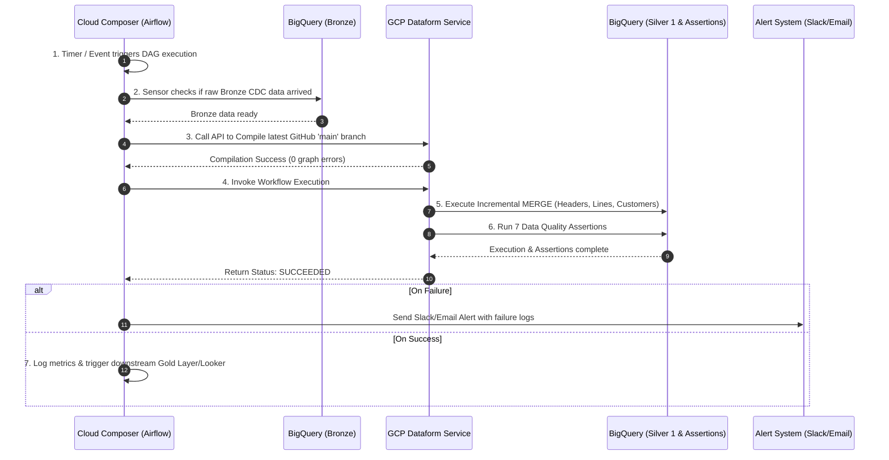

# Oracle EBS Bronze to Silver 1 Dataform Pipeline

This repository contains a production-ready **Google Cloud Dataform (Core v3+)** pipeline and **Cloud Composer (Apache Airflow)** automation DAG. It cleans, deduplicates, transforms, and validates Change Data Capture (CDC) extracts from an **Oracle E-Business Suite (EBS) Order Management** system in BigQuery, migrating raw data from the **Bronze layer** (`oracle_ebs_bronze`) to a structured, query-optimized **Silver 1 layer** (`oracle_ebs_silver1`).

---

## How It Works



The automated pipeline operates across 8 distinct sequential stages managed end-to-end by Cloud Composer and Dataform:

### Step 1: Trigger & Schedule
- **Automated Scheduling**: Cloud Composer (Airflow DAG `ebs_bronze_to_silver1_pipeline`) initiates execution automatically based on a cron schedule (e.g., hourly at minute 0: `0 * * * *`).
- **Event-Driven Execution**: Can also be triggered automatically when upstream ingestion tools (such as Fivetran, Qlik Replicate, GoldenGate, or Airbyte) finish dumping new raw CDC batches into BigQuery Bronze.

### Step 2: Data Readiness Check
- Before running transformations, an upstream sensor checks `oracle_ebs_bronze.OE_ORDER_HEADERS_ALL` to ensure new CDC records have arrived.
- Prevents unnecessary slot consumption and avoids processing empty or incomplete data batches.

### Step 3: Dataform Repository Compilation
- Composer sends an API request to the GCP Dataform API (`DataformCreateCompilationResultOperator`).
- Dataform fetches the latest repository code from the `main` Git branch.
- Dataform compiles `workflow_settings.yaml` and all `.sqlx` definitions, building a Dependency Direct Acyclic Graph (DAG) and ensuring zero syntax or graph structural errors.

### Step 4: Incremental MERGE Execution
- Composer invokes workflow execution (`DataformCreateWorkflowInvocationOperator`), running BigQuery SQL transformations in strict dependency order:
  1. **Incremental Filtering**: Filters raw records where `LAST_UPDATE_DATE >= MAX(last_update_date)` of existing Silver 1 tables.
  2. **CDC Deduplication**: Ranks updates via `ROW_NUMBER() OVER (PARTITION BY primary_key ORDER BY LAST_UPDATE_DATE DESC, _FIVETRAN_SYNCED DESC)` to select only the latest state (`row_num = 1`).
  3. **Soft Delete Filtering**: Excludes records where `_FIVETRAN_DELETED IS TRUE`.
  4. **BigQuery MERGE**: Performs atomic upserts into target Silver 1 tables (`stg_ebs_oe_order_headers`, `stg_ebs_oe_order_lines`, `stg_ebs_hz_cust_accounts`).

### Step 5: Automated Data Quality Assertions
Immediately after table materializations finish, Dataform executes **7 automated assertions** against the target tables in schema `oracle_ebs_assertions`:
- **Primary Key Uniqueness**: Verifies no duplicate `header_id`, `line_id`, or `cust_account_id` entries exist.
- **Non-Null Constraints**: Validates that critical business fields (`header_id`, `line_id`, `cust_account_id`, `ordered_quantity`) are non-null.
- **Referential Integrity Check** (`assert_order_lines_header_fk`): Custom SQL assertion verifying every order line references a valid header in `stg_ebs_oe_order_headers`.

### Step 6: Status Monitoring & Polling
- Cloud Composer monitors the execution status via API polling until the Dataform job reaches a terminal state (`SUCCEEDED` or `FAILED`).

### Step 7: Automated Error Handling & Alerting
- If any transformation query fails or any of the 7 quality assertions fail:
  - Execution halts immediately to prevent corrupting downstream tables.
  - Airflow triggers automatic retries based on configured retry policy (e.g., retry once after 5 minutes).
  - If retries fail, Composer sends immediate alert notifications (Email, Slack, or PagerDuty) with error stack traces and BigQuery execution IDs.

### Step 8: Downstream Integration
- Upon successful execution (`SUCCEEDED`), Composer logs pipeline performance metrics (duration, rows processed) and triggers downstream analytical processes (e.g., Gold layer aggregation, ML model feature pipelines, or Looker dashboard cache updates).

---

## Repository Structure

```
.
├── workflow_settings.yaml         # Dataform Core v3+ project configuration
├── README.md                      # Pipeline documentation & architecture guide
├── definitions/
│   ├── sources/                   # Bronze layer table declarations
│   │   ├── src_oe_order_headers_all.sqlx
│   │   ├── src_oe_order_lines_all.sqlx
│   │   └── src_hz_cust_accounts.sqlx
│   ├── silver1/                   # Silver 1 incremental transformations
│   │   ├── stg_ebs_oe_order_headers.sqlx
│   │   ├── stg_ebs_oe_order_lines.sqlx
│   │   └── stg_ebs_hz_cust_accounts.sqlx
│   └── assertions/                # Custom Data Quality assertions
│       └── assert_order_lines_header_fk.sqlx
├── dags/                          # Cloud Composer (Airflow) automation DAGs
│   └── ebs_bronze_to_silver1_pipeline.py
└── scripts/                       # Test seed scripts for local validation
    └── seed_bronze_tables.sql
```

---

## Local Development & Compilation

### 1. Prerequisites
- Node.js (v18+)
- `@dataform/cli` (v3.0.0+)

### 2. Compile Project
To compile the Dataform project locally and verify the graph:
```bash
npx -y @dataform/cli compile
```

### 3. Seed Mock Bronze Data (Optional Testing)
Execute the seed script in your BigQuery console to populate sample Bronze CDC data (including initial inserts, updates, and soft deletes):
```bash
bq query --use_legacy_sql=false < scripts/seed_bronze_tables.sql
```

---

## Cloud Composer Deployment

1. Copy [dags/ebs_bronze_to_silver1_pipeline.py](file:///usr/local/google/home/pradeepsarathy/AntiGravity_Projects/Project_3/coned_dataform_bronze_to_silver1/dags/ebs_bronze_to_silver1_pipeline.py) to your Cloud Composer environment's `dags/` bucket.
2. Ensure the Cloud Composer Service Account has the following IAM roles:
   - `Dataform Editor`
   - `BigQuery Data Editor`
   - `BigQuery Job User`
3. Update `GCP_PROJECT_ID` in `workflow_settings.yaml` and `ebs_bronze_to_silver1_pipeline.py`.
